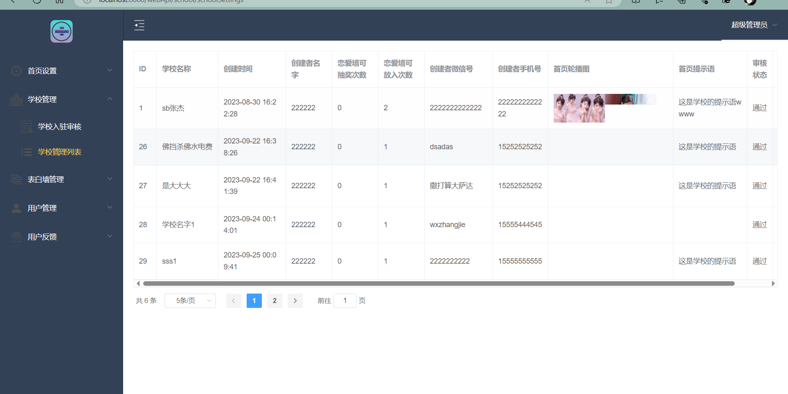
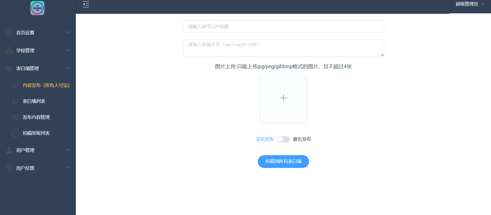
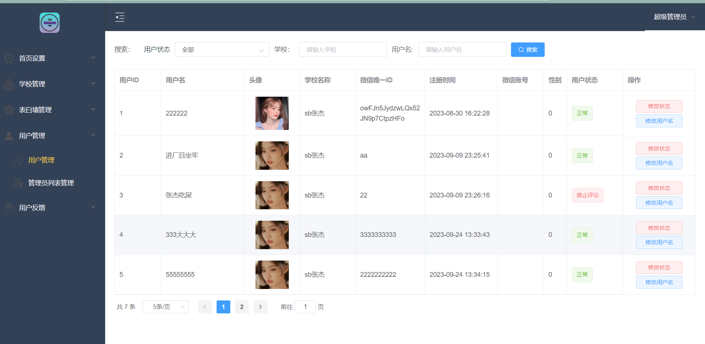
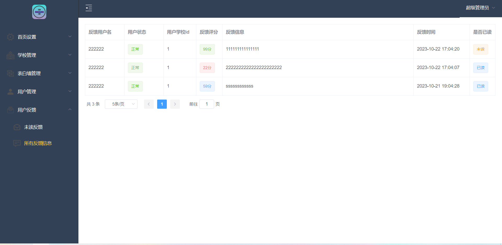

# LoveWall

## 介绍
**功能特点**：这个程序是一个在线平台，允许用户匿名或实名发布表白信息，并可以查看和浏览所有的表白内容，做到表白墙直接内容的隔离，管理员可以发布所有人可见的投稿，热数据用缓存来承载，独特的缓存设计方式高效利用内存空间以及提高性能，用定时任务来定时的清理缓存的数据，防止内存过载

主要功能：登录，绑定学校注册，注册学校以及后台审核，发布投稿，删除投稿，发布评论，删除评论，首页轮播以及后台设置，评论回复，投稿审核，加好友

## 技术栈

- 后台：springboot+mybaits-plus
- web管理端：vue+element-ui
- 微信小程序：微信原生+vant组件库
- 数据库：mysql5.7+redis

## 项目演示图片

### 微信小程序

### web管理端

