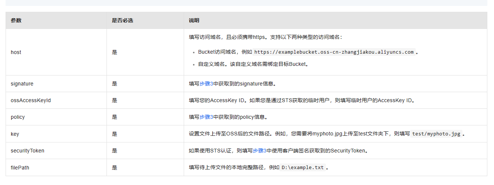
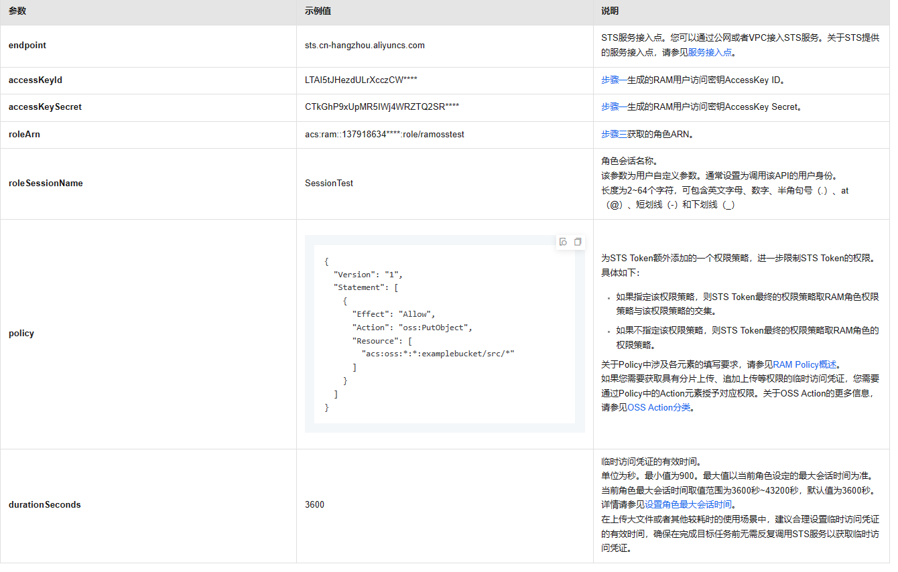
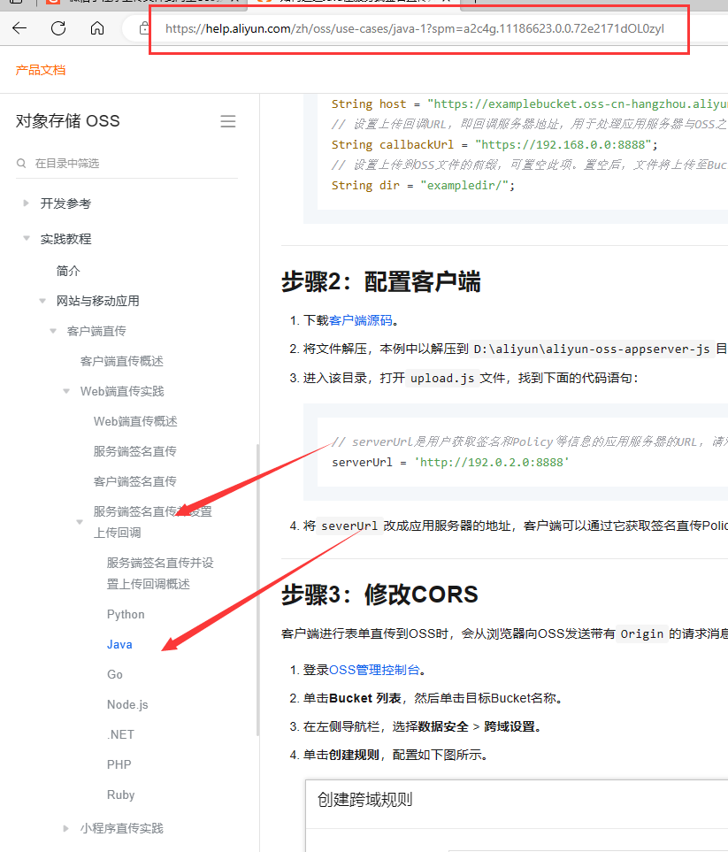
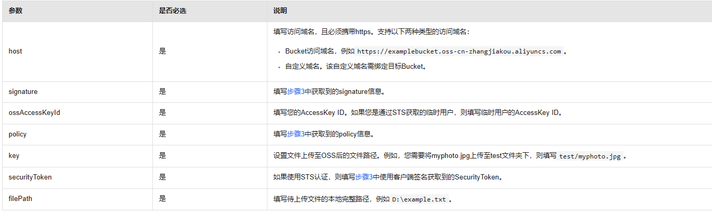

项目本来是想把图片信息都存在本地的，但是后来买云服务器才发现他有带宽限制，那个速度图片理论上根本访问不了，所以想到用阿里云的oos对象存储来存图片，含泪重写

## 第一步

登录 ->阿里云-> 控制台 ->对象存储oos->Bucket列表->点击创建的你的节点(在列表的左边)->然后再点击左边**概览**，拿到Bucket域名，然后去设置小程序

登录->小程序管理界面->(左边)**开发**->开发管理->开发设置->服务器域名->   把Bucket域名 添加到Bucket 域名和downloadFile合法域名里面

## 前端小程虚上传参数 不用sys了



## 第二步 不用了

### 使用STS临时访问凭证访问OSS

1. App用户登录。App用户和云账号无关，它是App的终端用户，App服务器支持App用户登录。对于每个有效的App用户来说，需要App服务器能定义出每个App用户的最小访问权限。
2. App服务器请求STS服务获取一个安全令牌（SecurityToken）。在调用STS之前，App服务器需要确定App用户的最小访问权限（用RAM Policy来自定义授权策略）以及凭证的过期时间。然后通过扮演角色（AssumeRole）来获取一个代表角色身份的安全令牌（SecurityToken）。
3. STS返回给App服务器一个临时访问凭证，包括一个安全令牌（SecurityToken）、临时访问密钥（AccessKeyId和AccessKeySecret）以及过期时间。
4. App服务器将临时访问凭证返回给App客户端，App客户端可以缓存这个凭证。当凭证失效时，App客户端需要向App服务器申请新的临时访问凭证。例如，临时访问凭证有效期为1小时，那么App客户端可以每30分钟向App服务器请求更新临时访问凭证。
5. App客户端使用本地缓存的临时访问凭证去请求OSS API。OSS收到访问请求后，会通过STS服务来验证访问凭证，正确响应用户请求。

查看阿里云官方文档如何给用户颁发临时凭证(严格按照官方文档或视频操作，不然一直会报参数异常)

[使用STS临时访问凭证访问OSS_对象存储 OSS-阿里云帮助中心 (aliyun.com)](https://help.aliyun.com/zh/oss/developer-reference/use-temporary-access-credentials-provided-by-sts-to-access-oss#concept-xzh-nzk-2gb)

参数详情：



遇到不懂的可以：

OpenAPI问题诊断地址： https://api.aliyun.com/troubleshoot?spm=api-workbench..0.0.2dcae85cUCMl7i

获取TST临时票据参数api文档： [AssumeRole_安全令牌_API文档-阿里云OpenAPI开发者门户 (aliyun.com)](https://api.aliyun.com/document/Sts/2015-04-01/AssumeRole?spm=api-workbench.Troubleshoot.0.0.45707185eH1Wxa)

### 客户端直传概述

[如何进行服务端签名直传_对象存储 OSS-阿里云帮助中心 (aliyun.com)](https://help.aliyun.com/zh/oss/use-cases/obtain-signature-information-from-the-server-and-upload-data-to-oss)



这里需要注意的这里可以采用的是，后端生产秘钥，然后还要对权限字符串计算签名，然后返回前端，才可以发送

这里采用服务端签名，客户端直接携带文件和身份数据上传到阿里云

阿里云oos依赖：

```xml
  <!-- 阿里云oss依赖 -->
        <dependency>
            <groupId>com.aliyun.oss</groupId>
            <artifactId>aliyun-sdk-oss</artifactId>
            <version>3.10.2</version>
        </dependency>
```

代码：       核心->开启sts服务->拿到秘钥->拿到临时凭证->签名->返回给前端

```java
 @Resource
    private ALiYunConfig config;

    @Override
    public Result uploadImageOOS() {
        // STS接入地址，例如sts.cn-hangzhou.aliyuncs.com。
        String endpoint = config.getEndpoint();
        // 从环境变量中获取步骤1生成的RAM用户的访问密钥（AccessKey ID和AccessKey Secret）。
        String accessKeyId = config.getKeyId();
        String accessKeySecret = config.getKeySecret();
        // 从环境变量中获取步骤3生成的RAM角色的RamRoleArn。
        String roleArn = config.getRamRoleArn();
        // 自定义角色会话名称，用来区分不同的令牌，例如可填写为SessionTest。
        String roleSessionName = "RamOssTest";
        // 以下Policy用于限制仅允许使用临时访问凭证向目标存储空间examplebucket下的src目录上传文件。
        // 临时访问凭证最后获得的权限是步骤4设置的角色权限和该Policy设置权限的交集，即仅允许将文件上传至目标存储空间examplebucket下的src目录。
        // 如果policy为空，则用户将获得该角色下所有权限。
        String policy = "{\n" +    //这里不用了，可以拿到角色所有权限
                "    \"Version\": \"1\",\n" +
                "    \"Statement\": [\n" +
                "        {\n" +
                "            \"Effect\": \"Allow\",\n" +
                "            \"Action\": \"oos:PutObject\",\n" +
                "            \"Resource\": [\n" +
                "                \"acs:oos:*:*dsad/src/*\"\n" +
                "            ]\n" +
                "        }\n" +
                "    ]\n" +
                "}";
        // 设置临时访问凭证的有效时间为1800秒。
        Long durationSeconds = 1800L;
        ImageUploadKeyDTO keyDTO;
        try {
            // regionId表示RAM的地域ID。以华东1（杭州）地域为例，regionID填写为cn-hangzhou。也可以保留默认值，默认值为空字符串（""）。
            String regionId = "sts.cn-shanghai.aliyuncs.com";
            // 添加endpoint。适用于Java SDK 3.12.0及以上版本。
//            DefaultProfile.addEndpoint(config.getBucketName(), regionId);
            // 添加endpoint。适用于Java SDK 3.12.0以下版本。
            DefaultProfile.addEndpoint("", regionId, "Sts", endpoint);
            // 构造default profile。
            IClientProfile profile = DefaultProfile.getProfile(regionId, accessKeyId, accessKeySecret);
            // 构造client。
            DefaultAcsClient client = new DefaultAcsClient(profile);
            final AssumeRoleRequest request = new AssumeRoleRequest();
            // 适用于Java SDK 3.12.0及以上版本。
//            request.setMethod(MethodType.POST);
            // 适用于Java SDK 3.12.0以下版本。
            request.setMethod(MethodType.POST);
            request.setRoleArn(roleArn);
            request.setRoleSessionName(roleSessionName);
//            request.setPolicy(policy);  //不设置，默认拥有改角色的所有权限
            request.setDurationSeconds(durationSeconds);
            final AssumeRoleResponse response = client.getAcsResponse(request);
            keyDTO = new ImageUploadKeyDTO();
            //  response.getCredentials().getExpiration() //过期时间，到时候看要不要加
            keyDTO.setAccessKeyId(response.getCredentials().getAccessKeyId());

            keyDTO.setSecurityToken(response.getCredentials().getSecurityToken());
            keyDTO.setHost(config.getEndpointNode());  //设置访问节点

            SimpleDateFormat simpleDateFormat = new SimpleDateFormat("yyyy-MM-dd");
            String format = simpleDateFormat.format(new Date());

            String key="src/"+format+"/"+this.generateFileName(".jpg"); //todo 后期优化，这里后缀名不拿了

            keyDTO.setKey(key);

            OSSClient ossClient = new OSSClient(endpoint, response.getCredentials().getAccessKeyId(), response.getCredentials().getAccessKeySecret());
            long expireTime = 30;
            long expireEndTime = System.currentTimeMillis() + expireTime * 1000;
            Date expiration = new Date(expireEndTime);
            PolicyConditions policyConds = new PolicyConditions();
            policyConds.addConditionItem(PolicyConditions.COND_CONTENT_LENGTH_RANGE, 0, 2 * 1024 * 1024);
            //根据参数dir计算的policy，如果和前端uploadfile中参数key的相应字段不一致的话是会报错的
            policyConds.addConditionItem(MatchMode.StartWith, PolicyConditions.COND_KEY, key);

            String postPolicy = ossClient.generatePostPolicy(expiration, policyConds);
            byte[] binaryData = postPolicy.getBytes();
            String encodedPolicy = BinaryUtil.toBase64String(binaryData); //base64转码之后的权限标识
            String postSignature = ossClient.calculatePostSignature(postPolicy);
            ossClient.shutdown();//业务完成一定要调用shutdown
            keyDTO.setPolicyBase64Str(encodedPolicy);
            keyDTO.setSignature(postSignature);
            keyDTO.setPolicyBase64Str(encodedPolicy);
        } catch (ClientException e) {
            System.out.println("Failed：");
            System.out.println("Error code: " + e.getErrCode());
            System.out.println("Error message: " + e.getErrMsg());
            System.out.println("RequestId: " + e.getRequestId());
            throw new WallException("获取上传秘钥失败！", 201);
        }
        if (keyDTO != null) {
            return Result.ok(keyDTO);
        } else {
            return Result.fail();
        }
    }

//dto 可以不封装的
@Data
public class ImageUploadKeyDTO {
    //访问keyId
    String accessKeyId;
    //临时秘钥签名
    String signature;
    //安全token
    String securityToken;
    //具体访问节点
    String host;
    //文件存放的相对路劲
    String key;
    //转码之后的权限标识
    String policyBase64Str;
}

```


## 第三步-小程序

编写微信小程序代码        流程： 获取必要的上传参数，然后携带file发送请求，这里没有写回调

参数：



```js
var api = require('./request');  //发送请求封装的工具方法

//使用回调函数让调用方拿到url
function uploadImagesAlibabaCloud(filePathTemp,callback) {
	let keyTemp = {};
	api.requestWithToken('/getStsToken', 'GET', null,
		(res) => {
			// console.log(res);
			if (res.data.code === 200) {
				keyTemp = res.data.data;
				//这里下面还有一次过滤，这里数据是从后端拿的，用的阿里云的sdk，先试试不用转换的
				const host = keyTemp.host;
				const signature = keyTemp.signature;
				const ossAccessKeyId = keyTemp.accessKeyId;
				const policy = keyTemp.policyBase64Str;
				const key = keyTemp.key;
				const securityToken = keyTemp.securityToken;
				const filePath = filePathTemp; // 待上传文件的文件路径。
				wx.uploadFile({
					url: host,
					filePath: filePath,
					name: 'file', // 必须填file。
					formData: {
						key,
						policy,
						OSSAccessKeyId: ossAccessKeyId,
						signature,
						'x-oss-security-token': securityToken // 使用STS签名时必传。
					},
					success: (res) => {
						// console.log(res);
						// if (res.statusCode === 204) {
						// 	console.log('上传成功');
						// }
						callback(keyTemp.host + '/' + keyTemp.key);
					},
					fail: err => {
						console.log(err);
						callback(null); // 或传递错误信息
					}
				});
			} else {
				console.error(res.data);
				callback(null); // 或传递错误信息
			}
		},
		(res) => {
			console.log(res);
		});
}

module.exports = {
	uploadImagesAlibabaCloud: uploadImagesAlibabaCloud
};
```

## web上传


