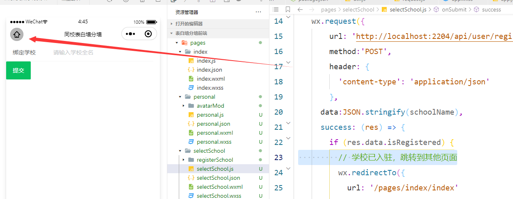

# 表白分墙

## 项目搭建

appid：

>技术栈：
>
>- java版本：8
>- 框架：springboot-.7.3+mybatis-plus-3.4.3
>- 数据库：mysql-5.7   看情况redis <下面没有依赖>

pom文件：

```xml
<?xml version="1.0" encoding="UTF-8"?>
<project xmlns="http://maven.apache.org/POM/4.0.0" xmlns:xsi="http://www.w3.org/2001/XMLSchema-instance"
         xsi:schemaLocation="http://maven.apache.org/POM/4.0.0 https://maven.apache.org/xsd/maven-4.0.0.xsd">
    <modelVersion>4.0.0</modelVersion>
    <parent>
        <groupId>org.springframework.boot</groupId>
        <artifactId>spring-boot-starter-parent</artifactId>
        <version>2.7.14</version>
        <relativePath/> <!-- lookup parent from repository -->
    </parent>
    <groupId>com.wall</groupId>
    <artifactId>loveWall</artifactId>
    <version>0.0.1-SNAPSHOT</version>
    <name>loveWall</name>
    <description>loveWall</description>
    <properties>
        <java.version>1.8</java.version>
        <spring-boot.version>2.7.14</spring-boot.version>
        <mybatis-plus.version>3.4.3</mybatis-plus.version>
    </properties>
    <dependencies>
        <dependency>
            <groupId>mysql</groupId>
            <artifactId>mysql-connector-java</artifactId>
            <version>5.1.49</version>
        </dependency>
        <dependency>
            <groupId>org.springframework.boot</groupId>
            <artifactId>spring-boot-starter-validation</artifactId>
        </dependency>

        <dependency>
            <groupId>org.projectlombok</groupId>
            <artifactId>lombok</artifactId>
            <optional>true</optional>
        </dependency>
        <!-- MyBatis Plus -->
        <dependency>
            <groupId>com.baomidou</groupId>
            <artifactId>mybatis-plus-boot-starter</artifactId>
            <version>${mybatis-plus.version}</version>
        </dependency>

        <dependency>
            <groupId>org.springframework.boot</groupId>
            <artifactId>spring-boot-starter-web</artifactId>
        </dependency>

        <dependency>
            <groupId>org.projectlombok</groupId>
            <artifactId>lombok</artifactId>
            <optional>true</optional>
        </dependency>
        <dependency>
            <groupId>org.springframework.boot</groupId>
            <artifactId>spring-boot-starter-test</artifactId>
            <scope>test</scope>
        </dependency>
    </dependencies>

    <build>
        <plugins>
            <plugin>
                <groupId>org.springframework.boot</groupId>
                <artifactId>spring-boot-maven-plugin</artifactId>
                <configuration>
                    <excludes>
                        <exclude>
                            <groupId>org.projectlombok</groupId>
                            <artifactId>lombok</artifactId>
                        </exclude>
                    </excludes>
                </configuration>
            </plugin>
        </plugins>
    </build>

</project>
```

## 需求

1. 用户可以设置学校，(通过实时定位获取位置里面的学校)，手动输入学校进行切换

2. 查看学校表白墙详情功能

3. 对表白墙上发布的内容进行评价，并做记录

4. 对学校的申请，管理员来审核他是否通过

5. 发布表白墙的接口

6. 对于本校的表白墙发布，由本校的管理员来审核(超级管理员指定)


## 表设计

```mysql
-- 删除用户表（User）如果存在
DROP TABLE IF EXISTS User;

-- 创建用户表（User）
CREATE TABLE User (
Id INT PRIMARY KEY AUTO_INCREMENT COMMENT '用户ID',
Username VARCHAR(255) NOT NULL COMMENT '用户名',
SchoolId INT COMMENT '学校ID',
WechatId VARCHAR(255) NOT NULL COMMENT '微信ID',
CreateTime TIMESTAMP DEFAULT CURRENT_TIMESTAMP COMMENT '创建时间',
WXAccount VARCHAR(255) COMMENT '微信账号',
Gender TINYINT(1) DEFAULT NULL COMMENT '性别，0表示女性，1表示男性，NULL表示未知',
AvatarURL VARCHAR(255) COMMENT '头像地址'
);

-- 删除学校表（School）如果存在
DROP TABLE IF EXISTS School;

-- 创建学校表（School）
CREATE TABLE School (
Id INT PRIMARY KEY AUTO_INCREMENT COMMENT '学校ID',
SchoolName VARCHAR(255) NOT NULL COMMENT '学校名称',
AvatarURL VARCHAR(255) COMMENT '头像地址',
Description TEXT COMMENT '描述内容',
CreatorId INT COMMENT '创建者ID',
CreateTime TIMESTAMP DEFAULT CURRENT_TIMESTAMP COMMENT '创建时间'
);

-- 删除表白墙表（ConfessionWall）如果存在
DROP TABLE IF EXISTS ConfessionWall;

-- 创建表白墙表（ConfessionWall）
CREATE TABLE ConfessionWall (
Id INT PRIMARY KEY AUTO_INCREMENT COMMENT '表白墙ID',
SchoolId INT COMMENT '学校ID',
CreatorUserId INT COMMENT '创建者用户ID',
AvatarURL VARCHAR(255) COMMENT '头像地址',
WallName VARCHAR(255) COMMENT '表白墙名字',
Description VARCHAR(255) NOT NULL COMMENT '表白墙描述',
CreateTime TIMESTAMP DEFAULT CURRENT_TIMESTAMP COMMENT '创建时间',
Status TINYINT COMMENT '状态，0表示正常，1表示被禁用',
FOREIGN KEY (SchoolId) REFERENCES School(Id),
FOREIGN KEY (CreatorUserId) REFERENCES User(Id)
);

-- 删除表白墙发布内容表——要管理员审核（ConfessionPostReview）如果存在
DROP TABLE IF EXISTS ConfessionPostReview;

-- 创建表白墙发布内容表——要管理员审核（ConfessionPostReview）
CREATE TABLE ConfessionPostReview (
Id INT PRIMARY KEY AUTO_INCREMENT COMMENT '审核记录ID',
PostIds JSON COMMENT '发布内容ID列表',
ReviewerId INT COMMENT '审核人ID',
ReviewStatus ENUM('Pending', 'Approved', 'Rejected') COMMENT '审核状态',
ReviewTime TIMESTAMP DEFAULT CURRENT_TIMESTAMP COMMENT '审核时间',
FOREIGN KEY (ReviewerId) REFERENCES User(Id)
);

-- 删除表白墙发布内容表（ConfessionPost）如果存在
DROP TABLE IF EXISTS ConfessionPost;

-- 创建表白墙发布内容表（ConfessionPost）
CREATE TABLE ConfessionPost (
Id INT PRIMARY KEY AUTO_INCREMENT COMMENT '发布内容ID',
WallId INT COMMENT '所属表白墙ID',
UserId INT COMMENT '发布者用户ID',
TextContent TEXT COMMENT '发布内容文字',
ImageURL VARCHAR(255) COMMENT '发布内容图片URL',
CreateTime TIMESTAMP DEFAULT CURRENT_TIMESTAMP COMMENT '创建时间',
IsDeleted BOOLEAN DEFAULT FALSE COMMENT '逻辑删除标志',
FOREIGN KEY (WallId) REFERENCES ConfessionWall(Id),
FOREIGN KEY (UserId) REFERENCES User(Id)
);

-- 删除评论表（Comment）如果存在
DROP TABLE IF EXISTS Comment;

-- 创建评论表（Comment）
CREATE TABLE Comment (
Id INT PRIMARY KEY AUTO_INCREMENT COMMENT '评论记录ID',
ConfessionPostReviewId INT COMMENT '关联的表白墙发布内容审核表ID',
ParentCommentId INT COMMENT '父级评论ID',
UserId INT COMMENT '用户ID',
CommentContent TEXT COMMENT '评论内容',
CommentTime TIMESTAMP DEFAULT CURRENT_TIMESTAMP COMMENT '评论时间',
IsDeleted BOOLEAN DEFAULT FALSE COMMENT '逻辑删除标志',
FOREIGN KEY (ConfessionPostReviewId) REFERENCES ConfessionPostReview(Id),
FOREIGN KEY (UserId) REFERENCES User(Id),
FOREIGN KEY (ParentCommentId) REFERENCES Comment(Id)
);

-- 删除管理员表（Admin）如果存在
DROP TABLE IF EXISTS Admin;

-- 创建管理员表（Admin）
CREATE TABLE Admin (
Id INT PRIMARY KEY AUTO_INCREMENT COMMENT '管理员ID',
SchoolId INT COMMENT '学校ID',
UserId INT COMMENT '用户ID',
PhoneNumber VARCHAR(20) COMMENT '手机号',
WeChatId VARCHAR(50) COMMENT '微信号',
CreateTime TIMESTAMP DEFAULT CURRENT_TIMESTAMP COMMENT '创建时间'
);
```

## 需求分解

1. 用户设置学校：
   - 提供实时定位功能，获取用户所在位置的学校信息。
   - 用户可以手动输入学校名称进行切换。
   - 在用户表（User）中添加字段SchoolId，用于记录用户所在的学校ID。
2. 查看学校表白墙详情功能：
   - 提供接口或页面，展示指定学校的表白墙详情信息。
   - 根据学校ID查询表白墙表（ConfessionWall），获取该学校的表白墙信息。
3. 对表白墙上发布的内容进行评价，并做记录：
   - 提供评论功能，用户可以对表白墙上的发布内容进行评价。
   - 在评论表（Comment）中记录评论内容、评论时间等信息。
   - 通过关联表（ConfessionPostReview）和表白墙发布内容表（ConfessionPost）的ID，将评论与对应的发布内容关联起来。
4. 对学校的申请进行审核：
   - 提供学校申请接口或页面，让用户提交学校申请信息。
   - 在管理员表（Admin）中添加字段ReviewStatus，表示审核状态，包括待审核、已通过、已拒绝。
   - 管理员可以查看学校申请列表，并进行审核操作，更新审核状态。
5. 发布表白墙的接口：
   - 提供接口或页面，让用户发布表白墙。
   - 在表白墙表（ConfessionWall）中插入一条新的记录，包括学校ID、创建者用户ID、表白墙名字、描述等信息。
6. 本校表白墙发布由管理员审核：
   - 超级管理员指定本校管理员。
   - 在管理员表（Admin）中添加字段IsSuperAdmin，表示是否为超级管理员。
   - 只有本校管理员才有权限审核本校的表白墙发布内容。
   - 在表白墙发布内容表（ConfessionPost）中添加字段IsDeleted，表示逻辑删除标志，在管理员审核通过后可以将发布内容标记为已删除。


# 需求编写

## 登录-注册

1. 获取用户的唯一标识：在小程序中，可以通过调用微信提供的登录接口 `wx.login` 获取用户的临时登录凭证 `code`。然后，将该 `code` 发送到后台服务器，后台服务器通过调用微信提供的接口 `code2Session` 来获取用户的 `openId` 和 `sessionKey`。
2. 向后台发送请求验证用户是否使用过该小程序：将获取到的 `openId` 发送到后台服务器，后台服务器根据 `openId` 判断用户是否使用过该小程序。如果用户使用过该小程序，后台服务器会返回一个 token 给前端。
3. 前端保存 token：前端可以将返回的 token 存储在全局变量中，以便后续的请求中使用。
4. 根据是否使用过该小程序进行页面跳转：根据后台返回的结果，如果用户使用过该小程序，则直接进入主页面；如果用户没有使用过该小程序，则跳转到选择学校的页面。

>code临时票据有效期5分钟，所以在登录的时候和选择学校注册的时候会重新拿到code

### 登录

程序一开始就会来到登录页面，如果没有选择学校注册过，就跳转页面

前端实例代码：

```js
({
  globalData: {
    token: null
  },
  onLaunch: function () {
    // 登录
    wx.login({
      success: res => {
        // 发送 res.code 到后台换取 openId, sessionKey, unionId   没有成功发现是第一次登录就会跳转页面拿着code+学校重新发起注册请求
        wx.request({
          url: 'https://your-backend-server.com/login',
          method: 'POST',
          data: {
            code: res.code
          },
          success: res => {
            if (res.data.token) {
              // 保存 token 到全局变量
              this.globalData.token = res.data.token;
              // 跳转到主页面
              wx.switchTab({
                url: '/pages/main/main'
              });
            } else {
              // 跳转到选择学校页面
              wx.navigateTo({
                url: '/pages/selectSchool/selectSchool?code=' + code
              });
            }
          },
          fail: err => {
            console.error(err);
          }
        });
      },
      fail: err => {
        console.error(err);
      }
    });
  }
});
```

后端实例代码： 通过code获取用户openId判断登录，前端来确定是进到首页还是选择学校注册

```java
	@PostMapping("login")
    public Result login(@RequestBody String code){
        String appId = wechatConfig.getAppId();
        String secret = wechatConfig.getAppSecret();

        String url = "https://api.weixin.qq.com/sns/jscode2session?appid=" + appId +
                "&secret=" + secret +
                "&js_code=" + code +
                "&grant_type=authorization_code";
        ResponseEntity<String> response = restTemplate.getForEntity(url, String.class);

        if (response.getStatusCode().is2xxSuccessful()) {
            String responseBody = response.getBody();
            // 解析响应体，提取 openId
            // 假设响应体为 JSON 格式：{"openid":"xxxxxxxxxxxxxxx","session_key":"yyyyyyyyyyyyyy"}
            // 这里使用了简单的字符串截取来提取 openId，请根据实际情况使用合适的 JSON 解析方式
            int startIndex = responseBody.indexOf("\"openid\":\"") + 10;
            int endIndex = responseBody.indexOf("\"", startIndex);
            String openid=responseBody.substring(startIndex, endIndex);
            // 根据 openid 查询数据库，看是否已存在该用户
            User user = userService.findByOpenid(openid);
            if (user == null) {
               return Result.build(206,"请选择学校");
            }
            String token = JwtConfig.getJwtToken(user);
            Map<String, Object> responseMap = new HashMap<>();
            responseMap.put("token", token);
            responseMap.put("username", user.getUsername());
            responseMap.put("avatarURL", user.getAvatarURL());

            return Result.ok(responseMap);
        } else {
            // 处理请求失败的情况
            return Result.fail("登录失败");
        }
    }
```

### 注册

这里会给到一个可以获取用户信息的code，后端拿到请求中的code发送请求获取用户信息，还有学校名字的话后台就会查询数据库，看学校是否存在，后台如果有该学校给用户绑定学校id，存在就会注册成功，返回token，如果没有该学校，告诉前端要去入驻学校


### 接口文档

>登录
>
>路径：api/user/login
>
>参数：wx.login里面的code临时票据
>
>- 如果成功表示用过，会返回token和用户名字，头像地址
>- 如果没有用过，反正的状态码是206，表示要去选择学校注册

>注册
>
>


用的springboot+mybatis-plus，代码接口，controller，service，serviceImpl

## 选择或注册学校

用户如果没有用过这个小程序不会有token，进来之后就会在选择学校的界面，按钮触发事件请求，返回来的信息是学校没有入驻，就会接着拿着我输入的学习跳转到注册学校的页面，这个是由后台审核的，然后我用了vant组件库，如果是入驻了的，就会返回一个token，将用户绑定号学习并写入在数据库里面，代码就不展示了

>注意在这之前用户已经向后台发起获取token的请求了，但是该用户未登录
>
>后台需要的接口：
>
>- 绑定学校用户输入学校还会传递code过来，后台先确定数据库里面有没有学校，如果有，这里已经给他绑定好学习id进来首页，如果没有，注册
>- 注册：输入学校名，微信号，手机号，还有携带后台小程序里面的code，入驻完之后就是后台会审核，审核通过就会默认给他分配一个表白墙，然后由他来修改名字和头像和描述

知识点：

- 每个临时登录凭证（code）的有效期是短暂的，通常为5分钟。这意味着在用户登录或重新打开小程序后的5分钟内，该凭证可以用于换取用户的唯一标识符（openId）、会话密钥（sessionKey）和联合标识符（unionId）等信息。
- 唯一标识符（openId）是每个用户在一个小程序或公众号中的唯一标识，它与用户的微信账号绑定。在用户登录小程序时，通过临时登录凭证（code）换取到的openId是长期有效的，可以用于后续的用户身份验证和数据操作。
- 会话密钥（sessionKey）是用于加密用户数据的密钥，每次用户登录或重新打开小程序时都会生成一个新的会话密钥。会话密钥的有效期与临时登录凭证（code）的有效期相同，通常为5分钟。
- 联合标识符（unionId）是在用户绑定了多个微信开放平台账号（如小程序、公众号等）时，用于区分不同账号的标识符。联合标识符的有效期与临时登录凭证（code）的有效期相同，通常为5分钟。

选择学校的时候



这里这个按钮之后让他消失，不选择学校不让他进首页，TODO


## 修改头像

修改头像在我里面，但是我要在后台做显示，每周可修改一次


