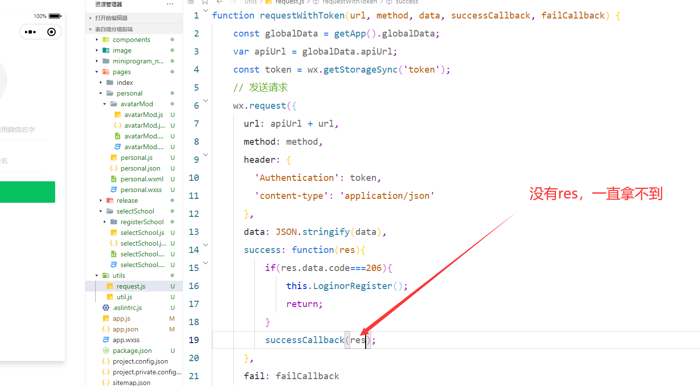
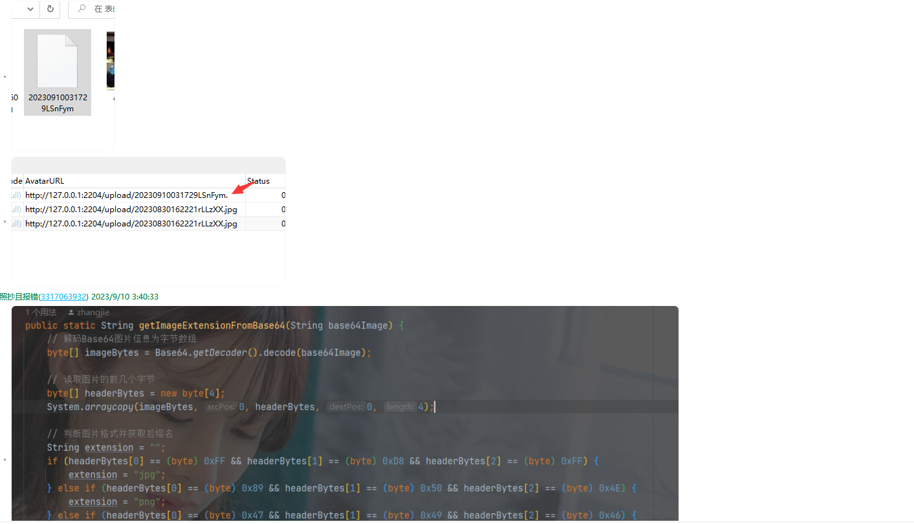
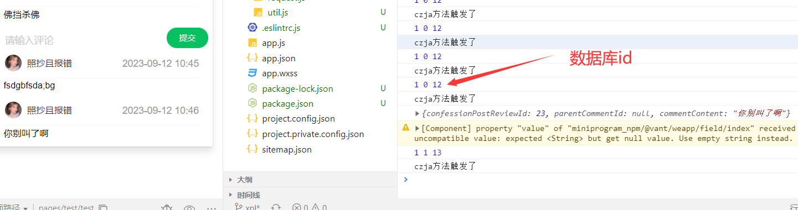
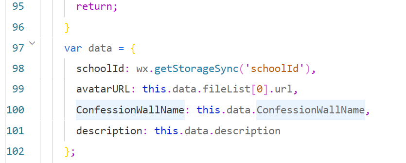
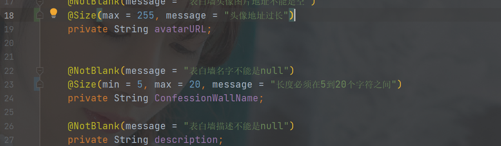
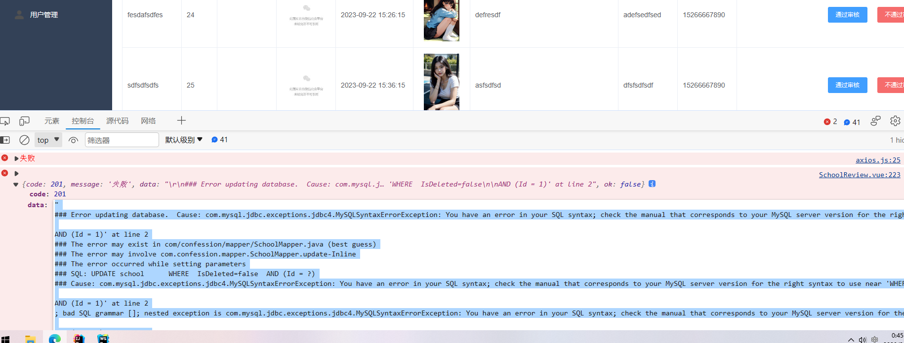
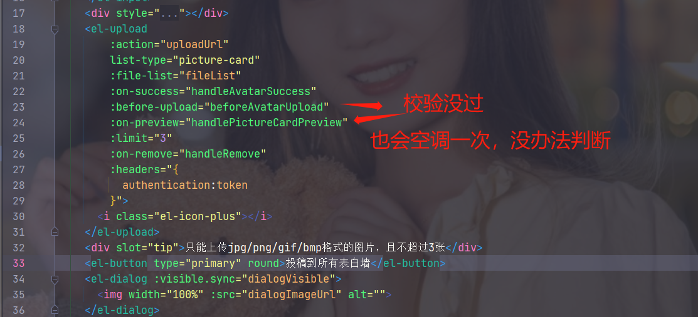
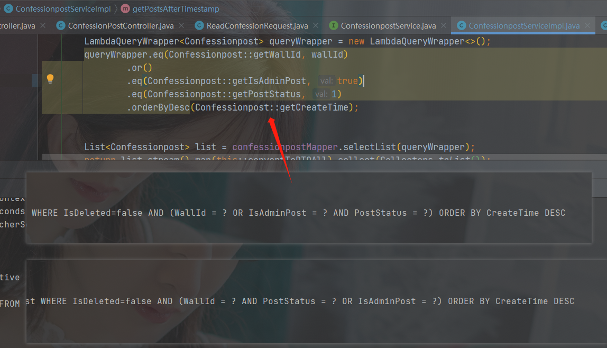

# 表白分墙

## 项目搭建

appid：

>技术栈：
>
>- java版本：8
>- 框架：springboot-.7.3+mybatis-plus-3.4.3
>- 数据库：mysql-5.7   看情况redis <下面没有依赖>

pom文件：

```xml
<?xml version="1.0" encoding="UTF-8"?>
<project xmlns="http://maven.apache.org/POM/4.0.0" xmlns:xsi="http://www.w3.org/2001/XMLSchema-instance"
         xsi:schemaLocation="http://maven.apache.org/POM/4.0.0 https://maven.apache.org/xsd/maven-4.0.0.xsd">
    <modelVersion>4.0.0</modelVersion>
    <parent>
        <groupId>org.springframework.boot</groupId>
        <artifactId>spring-boot-starter-parent</artifactId>
        <version>2.7.14</version>
        <relativePath/> <!-- lookup parent from repository -->
    </parent>
    <groupId>com.wall</groupId>
    <artifactId>loveWall</artifactId>
    <version>0.0.1-SNAPSHOT</version>
    <name>loveWall</name>
    <description>loveWall</description>
    <properties>
        <java.version>1.8</java.version>
        <spring-boot.version>2.7.14</spring-boot.version>
        <mybatis-plus.version>3.4.3</mybatis-plus.version>
    </properties>
    <dependencies>
        <dependency>
            <groupId>mysql</groupId>
            <artifactId>mysql-connector-java</artifactId>
            <version>5.1.49</version>
        </dependency>
        <dependency>
            <groupId>org.springframework.boot</groupId>
            <artifactId>spring-boot-starter-validation</artifactId>
        </dependency>

        <dependency>
            <groupId>org.projectlombok</groupId>
            <artifactId>lombok</artifactId>
            <optional>true</optional>
        </dependency>
        <!-- MyBatis Plus -->
        <dependency>
            <groupId>com.baomidou</groupId>
            <artifactId>mybatis-plus-boot-starter</artifactId>
            <version>${mybatis-plus.version}</version>
        </dependency>

        <dependency>
            <groupId>org.springframework.boot</groupId>
            <artifactId>spring-boot-starter-web</artifactId>
        </dependency>

        <dependency>
            <groupId>org.projectlombok</groupId>
            <artifactId>lombok</artifactId>
            <optional>true</optional>
        </dependency>
        <dependency>
            <groupId>org.springframework.boot</groupId>
            <artifactId>spring-boot-starter-test</artifactId>
            <scope>test</scope>
        </dependency>
    </dependencies>

    <build>
        <plugins>
            <plugin>
                <groupId>org.springframework.boot</groupId>
                <artifactId>spring-boot-maven-plugin</artifactId>
                <configuration>
                    <excludes>
                        <exclude>
                            <groupId>org.projectlombok</groupId>
                            <artifactId>lombok</artifactId>
                        </exclude>
                    </excludes>
                </configuration>
            </plugin>
        </plugins>
    </build>

</project>
```

## 需求

1. 用户可以设置学校，(通过实时定位获取位置里面的学校)，手动输入学校进行切换

2. 查看学校表白墙详情功能

3. 对表白墙上发布的内容进行评价，并做记录

4. 对学校的申请，管理员来审核他是否通过

5. 发布表白墙的接口

6. 对于本校的表白墙发布，由本校的管理员来审核(超级管理员指定)


## 表设计

```mysql
-- 删除用户表（User）如果存在
DROP TABLE IF EXISTS User;

--  用户表（User） OpenId建立唯一键索引
CREATE TABLE User (
                      Id INT PRIMARY KEY AUTO_INCREMENT COMMENT '用户ID',
                      Username VARCHAR(255) NOT NULL COMMENT '用户名',
                      SchoolId INT COMMENT '学校ID',
                      OpenId VARCHAR(255) NOT NULL COMMENT '微信唯一ID',
                      CreateTime DATETIME DEFAULT CURRENT_TIMESTAMP COMMENT '创建时间',
                      UpdateTime DATETIME DEFAULT CURRENT_TIMESTAMP ON UPDATE CURRENT_TIMESTAMP COMMENT '更新时间',
                      WXAccount VARCHAR(255) COMMENT '微信账号',
                      Gender TINYINT(2) DEFAULT NULL COMMENT '性别，1表示男性，2表示女性，0表示未知',
                      AvatarURL VARCHAR(255) COMMENT '头像地址',
                      Status TINYINT(2) DEFAULT 0 COMMENT '用户状态，0表示正常，1表示被禁止发布，2表示禁止评论，3表示评论和发布都不可以',
                      UNIQUE INDEX idx_openid (OpenId)
);
INSERT INTO `user` VALUES (1, '照抄且报错', 1, 'owFJn5JydzwLQx52JN9p7CtpzHFo',
                           '2023-08-30 16:22:28', '2023-08-30 16:22:28', NULL, NULL,
                           'http://127.0.0.1:2204/upload/20230830162221rLLzXX.jpg', 0,0);
                           
                           

DROP TABLE IF EXISTS School;

-- 学校表（School）  后面会在学校名字这里加唯一约束
CREATE TABLE School (
                        Id INT PRIMARY KEY AUTO_INCREMENT COMMENT '学校ID',
                        SchoolName VARCHAR(255) NOT NULL COMMENT '学校名称',
                        AvatarURL VARCHAR(255) COMMENT '头像地址',
                        Description TEXT COMMENT '描述内容',
                        CreatorId INT COMMENT '创建者ID',
                        CreateTime DATETIME DEFAULT CURRENT_TIMESTAMP COMMENT '创建时间',
                        CarouselImages TEXT COMMENT '轮播图图片地址',
                        Prompt VARCHAR(255) comment '学校提示语',
					  IsVerified TINYINT DEFAULT 0 COMMENT '审核状态，0表示未通过，1表示通过',
                        IsDeleted BOOLEAN DEFAULT FALSE COMMENT '逻辑删除标志'
                       
);

INSERT INTO School (SchoolName, AvatarURL, Description, CreatorId, CreateTime)
VALUES ('学校A', 'https://example.com/avatar1.jpg', '这是学校A的描述', 1, '2023-08-30 16:22:28'),
       ('学校B', 'https://example.com/avatar2.jpg', '这是学校B的描述', 2, '2023-08-30 16:22:28');


-- 删除表白墙表（ConfessionWall）如果
DROP TABLE IF EXISTS ConfessionWall;
-- 表白墙表（ConfessionWall）
CREATE TABLE ConfessionWall (
                                Id INT PRIMARY KEY AUTO_INCREMENT COMMENT '表白墙ID',
                                SchoolId INT COMMENT '学校ID',
                                CreatorUserId INT COMMENT '创建者用户ID',
                                AvatarURL VARCHAR(255) COMMENT '头像地址',
                                WallName VARCHAR(255) COMMENT '表白墙名字',
                                Description VARCHAR(255) NOT NULL COMMENT '表白墙描述',
                                CreateTime DATETIME DEFAULT CURRENT_TIMESTAMP COMMENT '创建时间',
                                Status TINYINT COMMENT '状态，0表示正常，1表示被禁用'
);
-- ConfessionWall 表测试数据
INSERT INTO ConfessionWall (SchoolId, CreatorUserId, AvatarURL, WallName, Description, CreateTime, Status)
VALUES (1, 1, 'https://example.com/avatar1.jpg', '表白墙A', '这是表白墙A的描述', '2023-08-30 16:22:28', 0),
       (2, 2, 'https://example.com/avatar2.jpg', '表白墙B', '这是表白墙B的描述', '2023-08-30 16:22:28', 1);

DROP TABLE IF EXISTS ConfessionPost;
-- 表白墙发布内容表（ConfessionPost）

CREATE TABLE `confessionpost`  (
  `Id` int(11) NOT NULL AUTO_INCREMENT COMMENT '发布内容ID',
  `WallId` int(11) NULL DEFAULT NULL COMMENT '所属表白墙ID',
  `UserId` int(11) NULL DEFAULT NULL COMMENT '发布者用户ID',
  `Title` varchar(30) CHARACTER SET utf8 COLLATE utf8_general_ci NULL DEFAULT NULL COMMENT '发布标题',
  `TextContent` text CHARACTER SET utf8 COLLATE utf8_general_ci NULL COMMENT '发布内容文字',
  `ImageURL` varchar(500) CHARACTER SET utf8 COLLATE utf8_general_ci NULL DEFAULT NULL COMMENT '发布内容图片URL',
  `CreateTime` datetime(0) NULL DEFAULT CURRENT_TIMESTAMP(0) COMMENT '投稿时间',
  `PublishTime` datetime(0) NULL DEFAULT NULL COMMENT '实际发布时间',
  `IsDeleted` tinyint(1) NULL DEFAULT 0 COMMENT '逻辑删除标志',
  `IsAnonymous` tinyint(1) NULL DEFAULT 0 COMMENT '是否匿名',
   `IsAdminPost` BOOLEAN DEFAULT FALSE COMMENT '是否为管理员发布的内容'
  `PostStatus` tinyint(4) NULL DEFAULT NULL COMMENT '发布状态，0表示待审核，1表示审核通过，2表示审核拒绝',
    IsAdminPost BOOLEAN DEFAULT FALSE COMMENT '是否为管理员发布的内容'
  PRIMARY KEY (`Id`) USING BTREE
) ENGINE = InnoDB AUTO_INCREMENT = 682 CHARACTER SET = utf8 COLLATE = utf8_general_ci ROW_FORMAT = Dynamic;


-- ConfessionPost 表测试数据
INSERT INTO ConfessionPost (WallId, UserId, Title, TextContent, ImageURL, CreateTime, PublishTime, IsDeleted, PostStatus)
VALUES
    (1, 1, '标题1', '这是第一篇表白内容', 'https://example.com/image1.jpg', NOW(), NOW(), FALSE, 1),
    (2, 2, '标题2', '这是第二篇表白内容', 'https://example.com/image2.jpg', NOW(), NOW(), FALSE, 0);


-- 删除评论表（Comment）如果存在
DROP TABLE IF EXISTS Comment;

--  评论表（Comment）  
CREATE TABLE Comment (
                         Id INT PRIMARY KEY AUTO_INCREMENT COMMENT '评论ID',
                         ConfessionPostReviewId INT COMMENT '关联发布内容表ID',
                         ParentCommentId INT COMMENT '父级评论ID',
                         UserId INT COMMENT '用户ID',
                         CommentContent TEXT COMMENT '评论内容',
                         CommentTime DATETIME DEFAULT CURRENT_TIMESTAMP COMMENT '评论时间',
                         IsDeleted BOOLEAN DEFAULT FALSE COMMENT '逻辑删除标志'
);

-- Comment 表测试数据
INSERT INTO Comment (ConfessionPostReviewId, ParentCommentId, UserId, CommentContent, IsDeleted)
VALUES (1, NULL, 1, '这是第一篇评论', FALSE),
       (2, NULL, 2, '这是第二篇评论', FALSE);

-- 删除管理员表（Admin）如果存在
DROP TABLE IF EXISTS Admin;

--  管理员表（Admin） 
CREATE TABLE Admin (
                       Id INT PRIMARY KEY AUTO_INCREMENT COMMENT '管理员ID',
                       SchoolId INT COMMENT '学校ID',
                       UserId INT COMMENT '用户ID',
                       ConfessionWallId INT COMMENT '表白墙ID',
                       PhoneNumber VARCHAR(20) COMMENT '手机号',
                       WeChatId VARCHAR(50) COMMENT '微信号',
                       CreateTime DATETIME DEFAULT CURRENT_TIMESTAMP COMMENT '时间',
                       Permission TINYINT COMMENT '权限标识，0表示普通管理员，1表示超级管理员'
);

-- Admin 表测试数据
INSERT INTO Admin (SchoolId, UserId, ConfessionWallId, PhoneNumber, WeChatId, Permission)
VALUES (1, 1, 1, '1234567890', 'adminwx1', 1),
       (2, 2, 2, '9876543210', 'adminwx2', 0);


DROP TABLE IF EXISTS msgconfiguration;
-- 创建提示语表
CREATE TABLE msgconfiguration (
  id INT AUTO_INCREMENT PRIMARY KEY, -- 提示语的唯一标识符
  Message VARCHAR(255) NOT NULL, -- 提示语内容
  MainSwitch BOOLEAN NOT NULL -- 开关状态，表示是否显示提示语
);


-- 纸条
DROP TABLE IF EXISTS Lottery;

CREATE TABLE Lottery (
  Id INT AUTO_INCREMENT PRIMARY KEY COMMENT '抽奖记录的唯一标识',
  SchoolId INT NOT NULL COMMENT '学校ID',
  UserId INT NOT NULL COMMENT '用户ID',
  ImageUrl VARCHAR(500) COMMENT '图片地址',
  ContactInfo VARCHAR(255) COMMENT '联系方式',
  Introduction VARCHAR(500) COMMENT '介绍',
  Gender TINYINT(1) COMMENT '性别，0表示男性，1表示女性',
  CreatedAt DATETIME DEFAULT CURRENT_TIMESTAMP COMMENT '记录创建时间',
  DrawCount INT DEFAULT 0 COMMENT '被抽到次数',
  IsDeleted TINYINT(1) DEFAULT 0 COMMENT '逻辑删除标志'
);
--纸条抽奖记录

DROP TABLE IF EXISTS LotteryRecord;


CREATE TABLE LotteryRecord (
  Id INT AUTO_INCREMENT PRIMARY KEY COMMENT '抽奖记录的唯一标识',
  LotteryId INT NOT NULL COMMENT '抽奖ID',
  UserId INT NOT NULL COMMENT '用户ID',
  DrawAt DATETIME DEFAULT CURRENT_TIMESTAMP COMMENT '抽奖时间',
	FOREIGN KEY (UserId) REFERENCES User(Id)
);
```

## 需求分解

1. 用户设置学校：
   - 提供实时定位功能，获取用户所在位置的学校信息。
   - 用户可以手动输入学校名称进行切换。
   - 在用户表（User）中添加字段SchoolId，用于记录用户所在的学校ID。
   
2. 查看学校表白墙详情功能：
   - 提供接口或页面，展示指定学校的表白墙详情信息。
   - 根据学校ID查询表白墙表（ConfessionWall），获取该学校的表白墙信息。
   
3. 对表白墙上发布的内容进行评价，并做记录：
   - 提供评论功能，用户可以对表白墙上的发布内容进行评价。
   - 在评论表（Comment）中记录评论内容、评论时间等信息。
   - 通过关联表（ConfessionPostReview）和表白墙发布内容表（ConfessionPost）的ID，将评论与对应的发布内容关联起来。
   
4. 对学校的申请进行审核：
   - 提供学校申请接口或页面，让用户提交学校申请信息。
   - 在管理员表（Admin）中添加字段ReviewStatus，表示审核状态，包括待审核、已通过、已拒绝。
   - 管理员可以查看学校申请列表，并进行审核操作，更新审核状态。
   
5. 发布表白墙的接口：
   - 提供接口或页面，让用户发布表白墙。
   - 在表白墙表（ConfessionWall）中插入一条新的记录，包括学校ID、创建者用户ID、表白墙名字、描述等信息。
   
6. 本校表白墙发布由管理员审核：
   - 超级管理员指定本校管理员。
   
   - 在管理员表（Admin）中添加字段IsSuperAdmin，表示是否为超级管理员。
   
   - 只有本校管理员才有权限审核本校的表白墙发布内容。
   
   - 在表白墙发布内容表（ConfessionPost）中添加字段IsDeleted，表示逻辑删除标志，在管理员审核通过后可以将发布内容标记为已删除。
   
     
   


# 提问模版

我的后端java用的springboot+mybaits-plus，请求和响应格式都是json，我的实体类都构建好了，我的代码结构是service和serviceImpl和Controller

通用返回类

@Data
public class Result<T> {

private Integer code;


​    private String message;

​    private T data;

​    public Result(){}

​    protected static <T> Result<T> build(T data) {
​        Result<T> result = new Result<T>();
​        if (data != null)
​            result.setData(data);
​        return result;
​    }

​    public static <T> Result<T> build(Integer code, String message) {
​        Result<T> result = *build*(null);
​        result.setCode(code);
​        result.setMessage(message);
​        return result;
​    }

​    public static<T> Result<T> ok(){
​        return Result.*ok*(null);
​    } }


# 需求编写

## 登录-注册-ok

1. 获取用户的唯一标识：在小程序中，可以通过调用微信提供的登录接口 `wx.login` 获取用户的临时登录凭证 `code`。然后，将该 `code` 发送到后台服务器，后台服务器通过调用微信提供的接口 `code2Session` 来获取用户的 `openId` 和 `sessionKey`。
2. 向后台发送请求验证用户是否使用过该小程序：将获取到的 `openId` 发送到后台服务器，后台服务器根据 `openId` 判断用户是否使用过该小程序。如果用户使用过该小程序，后台服务器会返回一个 token 给前端。
3. 前端保存 token：前端可以将返回的 token 存储在全局变量中，以便后续的请求中使用。
4. 根据是否使用过该小程序进行页面跳转：根据后台返回的结果，如果用户使用过该小程序，则直接进入主页面；如果用户没有使用过该小程序，则跳转到选择学校的页面。

>code临时票据有效期5分钟，所以在登录的时候和选择学校注册的时候会重新拿到code

### 登录

程序一开始就会来到登录页面，如果没有选择学校注册过，就跳转页面

前端实例代码：

```js
App({
	onLaunch: function () {
	  wx.login({
		success: res => {
		  // 发送 res.code 到后台获取openid查询用户是否登录过  没有则跳转好选择学校处注册
		  wx.request({
			  url: 'http://localhost:2204/api/user/login',
			  method:'POST',
			  header: {
				'content-type': 'application/json'
			  },
			data:JSON.stringify(res.code),
			success: res => {
			  if (res.data.code===200) {
				// 保存 token 到全局变量
				this.globalData.token = res.data.token;
				this.globalData.token = res.data.userInfo;
				// 跳转到主页面
				wx.switchTab({
				  url: '/pages/index/index'
				});
			  }
			  if(res.data.code===206){ //206表示用户没有选择学校注册
				wx.redirectTo({
					url: '/pages/selectSchool/selectSchool'
				  });
				  wx.showToast({
					title: '选择好您的学校之后会自动绑定贵校表白墙',
					icon: 'none', // success, loading, none
					duration: 3000
				  });
			  }
			},
			fail: err => {
			  console.error(err);
			}
		  });
		},
		fail: err => {
		  console.error(err);
		}
	  });
	},
  globalData: {
	apiUrl: 'http://localhost:2204',
	token:null,
	userInfo:{}
  }
})

```

后端实例代码： 通过code获取用户openId判断登录，前端来确定是进到首页还是选择学校注册

```java
	@PostMapping("login")
    public Result login(@RequestBody String code){
        String appId = wechatConfig.getAppId();
        String secret = wechatConfig.getAppSecret();

        String url = "https://api.weixin.qq.com/sns/jscode2session?appid=" + appId +
                "&secret=" + secret +
                "&js_code=" + code +
                "&grant_type=authorization_code";
        ResponseEntity<String> response = restTemplate.getForEntity(url, String.class);

        if (response.getStatusCode().is2xxSuccessful()) {
            String responseBody = response.getBody();
            // 解析响应体，提取 openId
            // 假设响应体为 JSON 格式：{"openid":"xxxxxxxxxxxxxxx","session_key":"yyyyyyyyyyyyyy"}
            // 这里使用了简单的字符串截取来提取 openId，请根据实际情况使用合适的 JSON 解析方式
            int startIndex = responseBody.indexOf("\"openid\":\"") + 10;
            int endIndex = responseBody.indexOf("\"", startIndex);
            String openid=responseBody.substring(startIndex, endIndex);
            // 根据 openid 查询数据库，看是否已存在该用户
            User user = userService.findByOpenid(openid);
            if (user == null) {
               return Result.build(206,"请选择学校");
            }
            String token = JwtConfig.getJwtToken(user);
            Map<String, Object> responseMap = new HashMap<>();
            responseMap.put("token", token);
            responseMap.put("username", user.getUsername());
            responseMap.put("avatarURL", user.getAvatarURL());

            return Result.ok(responseMap);
        } else {
            // 处理请求失败的情况
            return Result.fail("登录失败");
        }
    }
```

### 注册

这里会给到一个可以获取用户信息的code，后端拿到请求中的code发送请求获取用户信息，还有学校名字的话后台就会查询数据库，看学校是否存在，后台如果有该学校给用户绑定学校id，存在就会注册成功，返回token，如果没有该学校，告诉前端要去入驻学校


### 接口文档

>登录
>
>路径：api/user/login
>
>参数：wx.login里面的code临时票据
>
>参数传递格式：JSON
>
>- 如果成功表示用过，会返回token和用户名字，头像地址
>- 如果没有用过，反正的状态码是206，表示要去选择学校注册

>注册用户-就是选择学校界面
>
>路径：api/user/register
>
>参数传递格式：JSON
>
>实体类
>
>```java
>@Data
>public class RegisterRequest {
>
>    private String code;
>
>    private String schoolName;
>
>    private String userName;
>
>    private String avatarUrl;
>
>}
>```


用的springboot+mybatis-plus，代码接口，controller，service，serviceImpl

## 注册学校&审核-ing

**优化点：注册学校和注册表白墙，还有表白投稿页面都使用了上传图片的组件到时候可以封装一下组件，避免代码重复**

用户如果没有用过这个小程序不会有token，进来之后就会在选择学校的界面，按钮触发事件请求，返回来的信息是学校没有入驻，就会接着拿着我输入的学习跳转到注册学校的页面，这个是由后台审核的，然后我用了vant组件库，如果是入驻了的，就会返回一个token，将用户绑定号学习并写入在数据库里面，代码就不展示了

>注意在这之前用户已经向后台发起获取token的请求了，但是该用户未登录
>
>后台需要的接口：
>
>- 绑定学校用户输入学校还会传递code过来，后台先确定数据库里面有没有学校，如果有，这里已经给他绑定好学习id进来首页，如果没有，注册
>- 注册：输入学校名，微信号，手机号，还有携带后台小程序里面的code，入驻完之后就是后台会审核，审核通过就会默认给他分配一个表白墙，然后由他来修改名字和头像和描述

知识点：

- 每个临时登录凭证（code）的有效期是短暂的，通常为5分钟。这意味着在用户登录或重新打开小程序后的5分钟内，该凭证可以用于换取用户的唯一标识符（openId）、会话密钥（sessionKey）和联合标识符（unionId）等信息。
- 唯一标识符（openId）是每个用户在一个小程序或公众号中的唯一标识，它与用户的微信账号绑定。在用户登录小程序时，通过临时登录凭证（code）换取到的openId是长期有效的，可以用于后续的用户身份验证和数据操作。
- 会话密钥（sessionKey）是用于加密用户数据的密钥，每次用户登录或重新打开小程序时都会生成一个新的会话密钥。会话密钥的有效期与临时登录凭证（code）的有效期相同，通常为5分钟。
- 联合标识符（unionId）是在用户绑定了多个微信开放平台账号（如小程序、公众号等）时，用于区分不同账号的标识符。联合标识符的有效期与临时登录凭证（code）的有效期相同，通常为5分钟。

选择学校的时候


这里这个按钮之后让他消失，不选择学校不让他进首页，TODO


## 修改头像-ok

todo  后面切换的之后吧之前的可以删除了，后面加

修改头像在我里面，但是我要在后台做显示，每周可修改一次.

要实现将文件存储为Base64编码的图片信息，并通过访问特定地址直接查看图片，可以按照以下步骤进行操作：

1. 将文件转换为Base64编码：
   - 使用适当的编程语言或工具，读取文件的二进制数据。
   - 将二进制数据进行Base64编码转换，生成对应的Base64字符串。
2. 创建一个服务器端路由处理程序：
   - 在服务器端创建一个路由处理程序，用于接收特定地址的请求。
   - 当接收到请求时，将保存的Base64字符串作为响应返回。
   - 确保设置正确的HTTP头部，以便将响应解释为图像数据。
3. 配置服务器：
   - 将服务器配置为监听特定地址和端口。
   - 确保在服务器上启动并运行该应用程序。
4. 通过浏览器访问图片：
   - 使用浏览器访问服务器上指定的地址（包含文件的Base64编码）。
   - 浏览器会解析响应，并将其显示为图片。

### 图片上传 -ok

 需求：是这样的我需要这样一个后端接口，我的前端会传递base64转码之后的图片，你需要将它转换好之后，还要判断大小如果超过4m，你就返回提示上次图片超过4m，我需要你将图片设置保存好，我需要把传递过来的按照日期加上6位的的随机数或英文字母命名，返回一个地址，这个地址需要我设置静态资源过滤，我的前端可以直接访 该图片

注意这是windows系统的代码，路径这里你需要注意  todo

```java
@Configuration
public class WebConfig extends WebMvcConfigurerAdapter {

    @Override
    public void addResourceHandlers(ResourceHandlerRegistry registry) {
        registry.addResourceHandler("/upload/**")
                .addResourceLocations("file:e:\\\\表白墙项目图片上传地址\\\\") // 设置图片上传路径
                //当客户端首次请求一个静态资源时，服务器会返回该资源，并在响应头中添加Cache-Control字段，
                // 使客户端将该资源保存在本地缓存中，并在接下来的365天内直接使用本地缓存，而无需再次从服务器获取该资源。
                .setCacheControl(CacheControl.maxAge(365, TimeUnit.DAYS));
    }
}

package com.confession.controller;
import com.confession.comm.Result;
import org.springframework.util.Base64Utils;
import org.springframework.web.bind.annotation.PostMapping;
import org.springframework.web.bind.annotation.RequestBody;
import org.springframework.web.bind.annotation.RestController;

import java.io.File;
import java.io.FileOutputStream;
import java.io.IOException;
import java.text.SimpleDateFormat;
import java.util.Date;
import java.util.Random;

@RestController
public class ImageController {

    private static final String UPLOAD_PATH = "e:\\\\表白墙项目图片上传地址\\\\"; // 设置图片上传路径

    @PostMapping("/uploadImage")
    public Result<String> uploadImage(@RequestBody String base64Image) {
        try {
            // 将Base64字符串解码为字节数组
            byte[] imageBytes = Base64Utils.decodeFromString(base64Image);

            // 检查图片大小是否超过4MB
            if (imageBytes.length > 4 * 1024 * 1024) {
                return Result.build(400, "上传的图片大小超过4MB");
            }

            // 获取图片后缀
            String fileExtension = getFileExtension(base64Image);

            // 根据日期和随机数生成文件名，并加上文件扩展名
            String fileName = generateFileName(fileExtension);

            // 构建文件对象
            File file = new File(UPLOAD_PATH, fileName);
            // 将字节数组写入文件
            try (FileOutputStream fos = new FileOutputStream(file)) {
                fos.write(imageBytes);
            }

            // 返回图片地址
            return Result.ok(UPLOAD_PATH + fileName);
        } catch (IOException e) {
            e.printStackTrace();
            return Result.build(500, "图片上传失败");
        }
    }

    private String generateFileName(String fileExtension) {
        SimpleDateFormat dateFormat = new SimpleDateFormat("yyyyMMdd");
        String datePrefix = dateFormat.format(new Date());
        String randomSuffix = generateRandomSuffix(6); // 生成6位随机数或英文字母
        return datePrefix + randomSuffix + fileExtension;
    }

    private String generateRandomSuffix(int length) {
        Random random = new Random();
        StringBuilder sb = new StringBuilder();
        for (int i = 0; i < length; i++) {
            int type = random.nextInt(2);
            switch (type) {
                case 0:
                    sb.append((char) (random.nextInt(26) + 'a')); // 生成小写字母
                    break;
                case 1:
                    sb.append((char) (random.nextInt(26) + 'A')); // 生成大写字母
                    break;
            }
        }
        return sb.toString();
    }

    private String getFileExtension(String base64Image) {
        String[] parts = base64Image.split(",");
        String mimeType = parts[0].split(";")[0].split(":")[1];
        String fileExtension = mimeType.split("/")[1];
        return "." + fileExtension;
    }

}
```



### 优化点

- 有点图片后缀是不支持支持的，可能是base64的限制，然后可以不知道可以给另外的提示，前端注意加
- 还有如果前端传递了图片到后端，然后没有提交然后直接退出了，图片就一直存在服务器里面，这里可以在添加的时候记录一下，写一个定时问题，把添加的图片记录好地址，如果没有在数据库里面找到，就去吧图片删除掉，或者在添加的时候就把图片打上标记，也是定时去扫描，一天之内没有提交就按照地址把图片删除了

### 可能存在问题

没拿到后缀，但是前端显示正常，原因是，我拿到的源文件默认是用画板打开的，我改了后缀。  删除jpg格式的数据失败



## 修改头像名字-ok

 需求：我需要一个修改头像的后端接口和修改名字的接口，用表里面的UpdateTime字段对他的接口调用评论做限制，每三天可改一次头像或者名字

```java
@RestController
@RequestMapping("/api/user")
public class UserController {

    @Autowired
    private UserService userService;

    @PostMapping("/avatar")
    public Result<Object> updateAvatar(@RequestBody UpdateAvatarRequest request) {
        int userId = getUserIdFromToken(); // 从请求头的token中获取用户ID
        User user = userService.getUserById(userId);
        if (user == null) {
            return Result.build(404, "用户不存在");
        }

        // 检查时间间隔
        if (!checkTimeInterval(user.getUpdateTime())) {
            return Result.build(400, "修改头像的时间间隔不足三天");
        }

        // 更新头像地址和更新时间
        user.setAvatarURL(request.getAvatarURL());
        user.setUpdateTime(new Date());
        userService.updateUser(user);

        return Result.ok();
    }

    @PostMapping("/name")
    public Result<Object> updateName(@RequestBody UpdateNameRequest request) {
        int userId = getUserIdFromToken(); // 从请求头的token中获取用户ID
        User user = userService.getUserById(userId);
        if (user == null) {
            return Result.build(404, "用户不存在");
        }

        // 检查时间间隔
        if (!checkTimeInterval(user.getUpdateTime())) {
            return Result.build(400, "修改名字的时间间隔不足三天");
        }

        // 更新用户名和更新时间
        user.setUsername(request.getUsername());
        user.setUpdateTime(new Date());
        userService.updateUser(user);

        return Result.ok();
    }

    private int getUserIdFromToken() {
        // 从请求头的token中解析并获取用户ID
        // 实现代码略
    }

    private boolean checkTimeInterval(Date lastUpdateTime) {
        // 计算当前时间与上次更新时间的间隔
        long currentTime = System.currentTimeMillis();
        long lastUpdateTimeMillis = lastUpdateTime.getTime();
        long interval = currentTime - lastUpdateTimeMillis;
        long threeDaysInMillis = 3 * 24 * 60 * 60 * 1000; // 三天的毫秒数

        return interval >= threeDaysInMillis;
    }
}

public class UpdateAvatarRequest {
    private String avatarURL;
}

public class UpdateNameRequest {
    private String username;
}

```

### 待优化点

修改头像之后，可以把之前的头像删除掉，注意缓存，redis里面有useDto的缓存

## 发布投稿-ok

用户发布和管理员发布都写好了

备注：主要功能就是图片的上传与删除，发布到表白墙，这里比如一个用户可以关注多个表白墙，每次发送发布请求会携带墙id，后台会校验，(看墙id和学校id是不是对应，如果做可以关注做个墙，可以再建立一个表来记录用户和墙的关系，也好做多墙数据的获取和前台显示)

我需要把我的发布的 题或图片信息提交到我的后台的一个接口，根据条件判断发布状态，如果是只有文字，我会执行一个方法类过滤，然后设置状态是1，通过，然后写入表里面，如果是携带图片的，那么他的状态就还是0，等待后台管理员审核完之后才修改他的状态，然后如果判断状态可以设置成1，那么就返回一个发布成功，如果要等待管理员审核才能通过的话就返回，等待管理员审核，如果是管理员发布的，直接发布，不用审核和过滤

```java
@RestController
@RequestMapping("/api/confession-wall")
public class ConfessionPostController {

    @Autowired
    private ConfessionPostService confessionPostService;

    @PostMapping("/submit")
    public Result submitConfessionPost(@RequestBody ConfessionPostRequest confessionRequest) {
        Integer userId = JwtInterceptor.getUser().getId();
        Integer schoolId = JwtInterceptor.getUser().getSchoolId();

        int count = confessionPostService.getPostCountByUserIdAndDate(userId, LocalDate.now());
        if (count >= DAILY_SUBMISSION_QUANTITY) {
            throw new WallException(CONTRIBUTE_OVER_LIMIT);
        }

        Integer wallInSchool = confessionPostService.isWallInSchool(schoolId, confessionRequest.getWallId());
        if (wallInSchool == null) {
            throw new WallException(DATA_ERROR);
        }

        boolean hasImage = (confessionRequest.getImageURL() != null && !confessionRequest.getImageURL().isEmpty());
        int status = 0;

        if (!hasImage) {
            boolean filterResult = confessionPostService.filterContent(confessionRequest);
            if (filterResult) {
                status = 1;
            }
        }

        ConfessionPost confessionPost = new ConfessionPost();
        if (status == 1) {
            confessionPost.setPublishTime(LocalDateTime.now());
        }

        confessionPost.setUserId(userId);
        confessionPost.setWallId(confessionRequest.getWallId());
        confessionPost.setImageURL(confessionRequest.getImageURL());
        confessionPost.setTitle(confessionRequest.getTitle());
        confessionPost.setTextContent(confessionRequest.getTextContent());
        confessionPost.setPostStatus(status);

        confessionPostService.save(confessionPost);

        String message = (status == 1) ? "发布成功" : "等待管理员审核";
        return Result.build(200, message);
    }

    @PostMapping("/submit-admin")
    public Result submitConfessionPostAsAdmin(@RequestBody ConfessionPostRequest confessionRequest) {
        Integer userId = JwtInterceptor.getUser().getId();
        Integer schoolId = JwtInterceptor.getUser().getSchoolId();

        Integer wallInSchool = confessionPostService.isWallInSchool(schoolId, confessionRequest.getWallId());
        if (wallInSchool == null) {
            throw new WallException(DATA_ERROR);
        }

        ConfessionPost confessionPost = new ConfessionPost();
        confessionPost.setUserId(userId);
        confessionPost.setWallId(confessionRequest.getWallId());
        confessionPost.setImageURL(confessionRequest.getImageURL());
        confessionPost.setTitle(confessionRequest.getTitle());
        confessionPost.setTextContent(confessionRequest.getTextContent());
        confessionPost.setPostStatus(1); // 直接设置为审核通过

        confessionPostService.save(confessionPost);

        return Result.ok();
    }
}

@Data
@EqualsAndHashCode(callSuper = false)
public class ConfessionPostRequest {
    private Integer wallId;
    private String title;
    private String textContent;
    private String imageURL;
}

```

service

```java
@Service
public class ConfessionPostService {

    @Autowired
    private ConfessionPostMapper confessionPostMapper;

    public void save(ConfessionPost confessionPost) {
        confessionPostMapper.insert(confessionPost);
    }

    public int getPostCountByUserIdAndDate(Integer userId, LocalDate date) {
        return confessionPostMapper.selectCount(new QueryWrapper<ConfessionPost>()
                .eq("user_id", userId)
                .eq("date(create_time)", date));
    }

    public Integer isWallInSchool(Integer schoolId, Integer wallId) {
        return confessionPostMapper.selectCount(new QueryWrapper<ConfessionPost>()
                .eq("school_id", schoolId)
                .eq("wall_id", wallId));
    }

    public boolean filterContent(ConfessionPostRequest confessionRequest) {
        // 过滤内容的逻辑
        // 返回 true 表示内容合法，返回 false 表示内容不合法
    }
}
```

### 优化

这里开始要设计缓存了，还有后面的评论也要加

> 本机缓存地址：     D:\java_app\Redis-x64-3.2.100

## 查看我的投稿申请和记录-ok

 需求：我需要一个后端接口来查询我的投稿申请，这个接口会返回内容表里面我发布状态是0的记录，还要从Thread里面获取用户id，JwtInterceptor.getUser()

```java
  @Override
    public List<ConfessionPostDTO> getPublishedPosts(Integer userId, PageTool pageTool) {
        return getPostsByStatus(pageTool,userId, 1);
    }

    @Override
    public List<ConfessionPostDTO> getPendingPosts(Integer userId,PageTool pageTool) {
        return getPostsByStatus(pageTool,userId, 0);
    }
    private List<ConfessionPostDTO> getPostsByStatus(PageTool pageTool,Integer userId, Integer postStatus) {
        LambdaQueryWrapper<Confessionpost> wrapper = new LambdaQueryWrapper<>();
        if (postStatus == 0) {
            wrapper.in(Confessionpost::getPostStatus, 0);
        } else {
            wrapper.notIn(Confessionpost::getPostStatus, 0);
        }
        wrapper.eq(Confessionpost::getUserId, userId);
        wrapper.orderByDesc(Confessionpost::getCreateTime); // 添加倒序排序条件  todo  后面看是否改成id倒序
        // 设置分页信息
        Page<Confessionpost> page = new Page<>(pageTool.getPage(), pageTool.getLimit());

        IPage<Confessionpost> iPage = confessionpostMapper.selectPage(page, wrapper);

        return iPage.getRecords().stream()
                .map(this::convertToDTO)
                .collect(Collectors.toList());
    }
```

```json
{
	"usingComponents": {
		"van-cell": "@vant/weapp/cell/index",
		"van-tag": "@vant/weapp/tag/index",
		"van-collapse": "@vant/weapp/collapse/index",
	  "van-collapse-item": "@vant/weapp/collapse-item/index",
	  "van-image": "@vant/weapp/image/index"
	},
	"onReachBottom": "onReachBottom",
    "enablePullDownRefresh": true
}

```

### 待优化点

onReachBottom() 上拉获取下一页这个函数的触发时机，后面要触底，上拉才会触发，如果数据不够是不会调用的，看着优化，还有到时候把id倒序是不是性能高一点

## 查看表白 -难点

### 后端

如果你希望将最近三天的数据缓存在 Redis 中，而超过三天的数据需要从数据库查询，同时每次调用接口都是分页查询，可以按照以下步骤进行操作：

1. 设置数据过期时间：在将数据存储到 Redis 中时，为每个数据项设置过期时间。对于最近三天的数据，可以将过期时间设置为三天后的时间点。
2. 分页查询逻辑：根据你的需求，每次调用接口进行分页查询。确定分页的页码和每页数据条数。
3. 查询 Redis：在接口调用时，首先判断当前页的数据是否在 Redis 中可用。如果是，则直接从 Redis 中获取分页数据，并返回给客户端。如果不是，则继续执行下一步。
4. 查询数据库：如果当前页的数据不在 Redis 中可用，就需要从数据库中查询数据。使用数据库查询语言（如 SQL）编写查询语句，根据时间范围和分页参数从数据库中检索符合条件的数据，并返回指定页的数据给客户端。
5. 存储数据到 Redis：在从数据库查询到数据后，如果这些数据是最近三天的数据，可以将其存储到 Redis 中，以供后续的分页查询使用。同时，为这些数据设置适当的过期时间，使其在三天后自动从 Redis 中删除。

>方案弃用：按照时间查询，每次查一页，这样又防止了新插入的数据，打算分页参数，保证了数据一致性，不然怕新数据写入或者删除倒是数据重复或者缺少

### 方案优化

按照时间查询，每次查询指定之后的一页，保证数据一致性

> 问gpt：
>
> 是这样的我的redis存放了我的投稿记录里面的三天的记录，然后我每次给到一个时间参数，查询该时间之后的10条参数，如果都在redis里面，就直接拿到返回，如果redis里面有一部分数据满足条件但是没有满足10条数据，那么他就会去查询redis记录里面最后的时间参数去查询数据库，拿到剩余的数据，合并返回给前端，如果要查询的时间是redis里面完全没有的，就直接查询数据库

```java
// 设置数据过期时间并存储到Redis中
String key = RedisConstant.CONFESSION_PREFIX + confessionPost.getWallId();
ZSetOperations<String, Object> zSetOperations = redisTemplate.opsForZSet();
zSetOperations.add(key, confessionPost, confessionPost.getPublishTime().toEpochSecond(ZoneOffset.UTC));
redisTemplate.expire(key, 3, TimeUnit.DAYS);

// 查询Redis中是否存在满足条件的数据
long startTimestamp = timestamp; // 前端传递的时间戳参数
long endTimestamp = Instant.now().getEpochSecond();
Set<Object> pageData = zSetOperations.rangeByScore(key, startTimestamp, endTimestamp);

if (pageData != null && !pageData.isEmpty()) {
    List<Object> result;
    
    if (pageData.size() >= pageSize) {
        // 如果Redis中有足够数量的数据满足条件，直接返回给客户端
        result = new ArrayList<>(pageData).subList(0, pageSize);
    } else {
        // 否则需要从数据库查询剩余的数据
        int remainingCount = pageSize - pageData.size();
        
        // 根据最后一条记录的时间参数，从数据库查询剩余的数据
        long lastTimestamp = zSetOperations.score(key, pageData.toArray()[pageData.size() - 1]);
        List<ConfessionPost> remainingData = confessionPostService.getPostsAfterTimestamp(confessionPost.getWallId(), lastTimestamp, remainingCount);
        
        // 合并两部分数据，并返回给客户端
        List<Object> mergedData = new ArrayList<>(pageData);
        mergedData.addAll(remainingData);
        result = mergedData.subList(0, pageSize);
    }
    
    return Result.ok(result);
} else {
    // 如果Redis中没有满足条件的数据，则直接从数据库查询
    List<ConfessionPost> postData = confessionPostService.getPostsAfterTimestamp(confessionPost.getWallId(), startTimestamp, pageSize);
    return Result.ok(postData);
}
```

### 方案弃用

zset无法设置单个结构的过期时间，这里就不能用来装一个学校的表白内容，过期时间都是一样的，所以意义不大用zset

### 查看评论

最终java方案：把评论分两个，一个主的直接用来展示，判断是否有数据来显示他的展示按钮，点击展示按钮，再去处理下面的字评论

```java
@Data
public class ConfessionPostDTO {
    private static final long serialVersionUID = 1L;
    private Integer id;
    private Integer wallId;
    private Integer userId;
    private String title;
    private String textContent;
    private List<String> imageURL;

    @JsonFormat(pattern = "yyyy-MM-dd HH:mm:ss")
    private LocalDateTime createTime;

    @JsonFormat(pattern = "yyyy-MM-dd HH:mm:ss")
    private LocalDateTime publishTime;

    private Integer postStatus;
    private Integer isAnonymous;

    private List<CommentDTO> mainComments;
    private List<CommentDTO> subComments;
}

@Data
public class CommentDTO {
    private Integer id;
    private Integer confessionPostReviewId;
    private Integer parentCommentId;
    private Integer userId;
    private String commentContent;
    private LocalDateTime commentTime;

    private String userName;
    private String avatarURL;
}
```

这里可以把发表到的内容的人的头像和昵称都放到redis，然后设置过期，每次都往那上面拉取，防止数据重复

### 前端

查询是按照时间查询，评论是分两个集合，一个主，一个子，要遍历找子评论，让用户可以看到是谁回复了谁  

### 最后-明天写

页面基本写好了，后面是分页查询了，一开始查询6条，后面每次三条：？ todo

想到需求

- 还有评论回复，想好可以看到多久的评论，是否需要添加用户字段记录上次登录时间，或者半年，

```json
  <van-notice-bar left-icon="notification" text="这是表白墙页面，请文明发言！"></van-notice-bar>


	"van-notice-bar": "@vant/weapp/notice-bar/index",
```

找了一圈，没有现成的代码，这里想使用组件库，低代码平台也不太行，把数据描述好，自己有大致的架子，自己写还是

需求：展示表白内容和，按照规则(比如最先或者评论有回复)的几条评论，表白内容下有输入框来进行评论，如果有多条评论就展示一部分之后，下面会有辨识，提示用户展开评论或者进入到详情页面，点击评论可以对评论进行回复(这里会在本地也会发送请求到后端)

>这里先打算根据建表语句生产模拟数据，先写静态页面，定要架子之后，再去确定后台要什么格式的数据，

评论列表：

```json
{
  "comments": [
    {
      "id": 1,
      "confessionPostReviewId": 1,
      "userId": 2,
      "commentContent": "这是一条父级评论",
      "commentTime": "2023-09-05T10:00:00",
      "childComments": [
        {
          "id": 2,
          "confessionPostReviewId": 1,
          "parentCommentId": 1,
          "userId": 3,
          "commentContent": "这是一条子级评论",
          "commentTime": "2023-09-05T11:00:00",
          "childComments": [
            {
              "id": 5,
              "confessionPostReviewId": 1,
              "parentCommentId": 2,
              "userId": 6,
              "commentContent": "这是对id为2的评论的回复",
              "commentTime": "2023-09-05T14:00:00"
            }
          ]
        },
        {
          "id": 4,
          "confessionPostReviewId": 1,
          "parentCommentId": 1,
          "userId": 5,
          "commentContent": "这是回复id为1的评论",
          "commentTime": "2023-09-05T13:00:00",
          "childComments": []
        }
      ]
    },
    {
      "id": 3,
      "confessionPostReviewId": 1,
      "userId": 4,
      "commentContent": "这是另一条父级评论",
      "commentTime": "2023-09-05T12:00:00",
      "childComments": []
    }
  ]
}

```

>这里按照之前的资料，描述清楚数据结构，然后描述需求

问gpt：是这样的，我想写一个微信小程序的投稿页面，我使用了vant组件，我的数据是这样的，我会有很多个组件，每个组件里面会有最上面是一个标题，然后是投稿内容，然后展示图片，下面有一个框，是用来发布评论的，下面再是展示评论，每个父评论，里面有id，父评论id：parentCommentId，和用户id：userId和commentContent评论内容还有commentTime评论时间，下面会有childComments字评论id，然后字组件id如果childComments有值的话就需要一个展开按钮，点击渲染子评论

## 发布评论-ok

>这里可以会把发布内容和评论都建立一个缓存，根据id嘛，保存三天的内容：可能会把发布内容和评论分开放，希望可以减少复杂度和大key的出现
>
>- 在建立发布内容缓存的时候就会：发布的时候直接把他放入数据库和缓存，先查询缓存是否有再查询数据库
>- 建立评论缓存的时候，把评论信息和评论出现的人的信息都放在redis，这样做的话个人信息就不需要额外的处理
>- 这里总的来说就是把一条记录的缓存分成3个来存储，设置三天之前的数据就不放到缓存，不然怕之前的缓存失效

### 发布评论-回复

需求：需要一个发布我的评论回复的接口，可以在里面设置父级评论id或者没有父级评论，可以直接设置表白墙绑定表白墙内容id

```java
@Data
@EqualsAndHashCode(callSuper = false)
public class PostCommentRequest {
        private Integer confessionPostReviewId;
        private Integer parentCommentId;
        private String commentContent;
}
```

```java
 @PostMapping("publishReply")
    public Result publishReply(@RequestBody PostCommentRequest request) {
        Integer id = JwtInterceptor.getUser().getId();
        Integer commentId = commentService.publishCommentReply(request, id);
        if (commentId!=null) {
            return Result.ok(commentId);
        } else {
            return Result.fail();
        }
    }
```

```java
 @Override
    public Integer publishCommentReply(PostCommentRequest request, Integer userId) {

        //todo  将来可能会把这个评论的发表直接同步到缓存,用户信息会上缓存

        int count = commentMapper.getCommentCountByUserIdAndDate(userId, LocalDate.now());
        System.out.println(count);
        if (count>=wallConfig.getUserDailyCommentLimit()){  //判断是否超过每天评论限制
            throw new WallException(COMMENT_OVER_LIMIT);
        }
        Comment comment = new Comment();
        comment.setConfessionPostReviewId(request.getConfessionPostReviewId());
        comment.setParentCommentId(request.getParentCommentId());
        comment.setUserId(userId);
        comment.setCommentContent(request.getCommentContent());
        comment.setCommentTime(LocalDateTime.now());
        // 获取插入数据的 ID
        commentMapper.insert(comment);
        Integer commentId = comment.getId();
        return commentId;
    }
```


## 我的评论回复

 需求：我需要一个查询我的评论回复的接口，表白墙发布内容表ID下面的评论，和父评论是我发布过的评论的信息，封装好发给前端

```java
@RestController
@RequestMapping("/api/confession-wall")
public class CommentController {

    @Autowired
    private CommentService commentService;
    @GetMapping("/comments/replies/{userId}/{postId}")
    public Result<List<Comment>> getCommentRepliesByUserIdAndPostId(
            @PathVariable("userId") int userId, 
            @PathVariable("postId") int postId) {
        List<Comment> commentReplies = commentService.getCommentRepliesByUserIdAndPostId(userId, postId);
        return Result.build(commentReplies);
    }
}

@Service
public class CommentService {

    @Autowired
    private CommentMapper commentMapper;

    public List<Comment> getCommentRepliesByUserIdAndPostId(int userId, int postId) {
        QueryWrapper<Comment> queryWrapper = new QueryWrapper<>();
        queryWrapper.eq("UserId", userId)
                    .eq("ConfessionPostReviewId", postId)
                    .isNotNull("ParentCommentId");
        return commentMapper.selectList(queryWrapper);
    }

    // 其他操作方法...
}
```

```html
<view wx:for="{{list}}" wx:key="id" class="zj">
	<view class="comment-item">
		<image class="avatar" src="{{item.avatarURL}}"></image>
		<view class="comment-info">
			<view class="user-info">
				<text class="user-name">@{{item.userName}}</text>
				<text class="reply-text">回复您</text>
			</view>
			<text class="comment-time">{{item.commentTime}}</text>
		</view>
	</view>
	<van-cell title="{{item.commentContent}}" size="large"></van-cell>
</view>
```

### 待优化点

- 可以点击获取用户的信息，点击跳转页面获取，这条表白投稿


## 审核投稿

 需求：我需要一个接口，获取到的列表里面发布状态是0的接口，但是调用这个接口的时候需要查询管理员表，确定改用户是不是管理员表有没有该用户，是不是这个墙的管理者，还有一个提交审核的接口，需要接口前端发送过来的信息，会传递这个内容表的id，还有是否通过，通过这个来修改表白墙发布内容表里面的发布状态

```java
@RestController
@RequestMapping("/api/confession-wall")
public class ConfessionPostController {

    @Autowired
    private ConfessionPostService postService;

    @Autowired
    private AdminService adminService;

    @GetMapping("/posts")
    public Result<List<ConfessionPost>> getPosts() {
        // 查询管理员表，确定用户是否为管理员并判断是否有权限
        int userId = 123; // 假设从token中获取到的用户ID
        boolean isAdmin = adminService.checkAdminByUserId(userId);
        if (!isAdmin) {
            return Result.build(403, "User is not an administrator");
        }

        // 获取发布状态为0的列表
        List<ConfessionPost> posts = postService.getPostsByStatus(0);
        return Result.ok(posts);
    }
    
      @PostMapping("/posts/review")
    public Result<String> reviewPost(@RequestBody ReviewRequest request) {
        // 查询管理员表，确定用户是否为管理员并判断是否有权限
        int userId = 123; // 假设从token中获取到的用户ID
        boolean isAdmin = adminService.checkAdminByUserId(userId);
        if (!isAdmin) {
            return Result.build(403, "User is not an administrator");
        }

        // 修改发布内容表的发布状态
        int postId = request.getPostId();
        int postStatus = request.getPostStatus();
        postService.updatePostStatus(postId, postStatus);

        return Result.ok("Review submitted successfully");
    }
}

```

校验是不是该墙的管理员要你自己写

## 轮播图

- 每个学校可以用下面的提示组件设置每个墙的提示语言，可以设置全部墙的默认发言
- 每个学校的轮播图都不一样，可以点击轮播图可以跳转

>todo 这里在学校后面加上了轮播图的字段，但是前后端的图片还没写，等待写后端管理系统再写

## 加好友

扩展点，小程序上面设置了qq或者微信号，别人看到我的投稿，我没有设置匿名发布，然后别人如果想要我的qq或微信，发送申请

## 恋爱投稿

1. 登录获取到用户信息，把微信的唯一id保存在本地变量，后面调用接口的时候会用到，保存比如抽到的纸条或者发布的纸条会用到
2. 首页里面会有男生或女生给你选择，选择完之后，会让你输入你的学习，这里可以用ajax异步的获取到学校的列表展示在下面
3. 输入完学校之后就是填写个人信息了，比如自我介绍，微信或者qq号，最下面加上一个微信二维码，然后提交，这里可能要两个接口，一个保存照片，一个上传个人信息
4. 上传完个人信息之后，后台记录改纸条，要记录好该纸条的被抽到的次数，后面用随机算法可能会用
5. 抽纸条的时候会输入学习，然后查询数据库，先把没有被抽到过的纸条抽了，然后再是被抽到过了随机给一个
6. 获取自己抽到的纸条和自己放入的纸条  两个接口3

```sql
CREATE TABLE Lottery (
  Id INT AUTO_INCREMENT PRIMARY KEY COMMENT '抽奖记录的唯一标识',
  SchoolId INT NOT NULL COMMENT '学校ID',
  UserId INT NOT NULL COMMENT '用户ID',
  ImageUrl VARCHAR(500) COMMENT '图片地址',
  ContactInfo VARCHAR(63) COMMENT '联系方式',
  Introduction VARCHAR(255) COMMENT '介绍',
  Gender TINYINT(1) COMMENT '性别，0表示男性，1表示女性',
  CreatedAt DATETIME DEFAULT CURRENT_TIMESTAMP COMMENT '记录创建时间',
  DrawCount INT DEFAULT 0 COMMENT '被抽到次数',
  IsDeleted TINYINT(1) DEFAULT 0 COMMENT '逻辑删除标志'
);
```

抽检记录表

```sql
CREATE TABLE LotteryRecord (
  Id INT AUTO_INCREMENT PRIMARY KEY COMMENT '抽奖记录的唯一标识',
  LotteryId INT NOT NULL COMMENT '抽奖ID',
  UserId INT NOT NULL COMMENT '用户ID',
  DrawAt DATETIME DEFAULT CURRENT_TIMESTAMP COMMENT '抽奖时间'
);
```

我想做到可以通过配置策略来实现对写入操作的接口调用控制，我写入的时候，会确定传递过来的用户id是否数据库里面有的数据，然后在查询这个记录表，比如我想控制每一年一个用户可以写入一个，或者一个月可以写入一个，或者只允许写入一个

## 注册学校

注册和审核先把后端接口写好, 对应的注册学校的时候，写入但是通过审核状态标识就好了，用户也查询不到，后面还有对应的注册表白墙了，但是表白墙没有审核表示，有禁用标识

## 首页设置

设置学校首页轮播图，还有全局提示语，全局提示语的开启和关闭，


# 项目未解决问题

- 缓存问题，用redis还要分页


1. 图片删除问题，防止用户恶意删除，判断时间和放做一个表里面然后做一个定时任务
2. 图片可能存在添加然后没有使用的问题，使用定时任务，扫描最近一天的文件，然后查询数据库，找到没有引用的删除了 ，


## 缓存问题-ok

我在做表白墙程序的投稿记录的缓存，我想使用redis的zset来做缓存，我的每一个墙对应的维护一个zset列表，对应的存储时间戳，然后里面存储对应的投稿id，我每次或发送一个分页参数过来，计算好之后去查询对应的id列表，这些id列表要做到和数据库的一致，获取到id列表之后再去查询对应的记录，你说这个列表怎么维护


1. 接收分页参数，比如页码和每页数量。
2. 使用Redis的有序集合（ZSet）来存储投稿的id，并根据发布时间作为分数。
3. 检查有序集合中是否存在足够的数据来满足分页条件。可以使用Redis的有序集合命令（例如ZCARD）来获取有序集合中的成员数量，并与分页条件进行比较。
4. 如果有序集合中的数据不足以满足分页条件，那么从数据库中查询缺失的数据，并将这些数据的id添加到有序集合中。
5. 将查询到的数据按照分页参数从有序集合中获取，并根据id再从数据库或其他缓存中获取完整的投稿记录。

请注意，这只是一个简化的流程示例，您可以根据实际需求进行适当的调整和优化。另外，确保在存储和检索数据时，考虑到数据的一致性和更新策略，以确保数据的准确性和有效性。


SpringCache自定义过期时间： https://blog.csdn.net/weixin_45390035/article/details/126932285 弃用

小程序上传图片到阿里云：https://blog.csdn.net/delebasou/article/details/85237941


## 添加功能

举报投稿，给超级管理员发信息-ok

取快递，私发消息，加好友，聊天室，小游戏


# bug记录

## 8.23

用@RequestBody传递一个code，用对象包裹一下，不然后出现code有双引号

## 9-5

在测试分页查询的时候，小程序端没有清理缓存，结果代码没错，没打日志没清缓存以为是代码问题

## 9-9

这是代码

```java
 @Override
    public List<CommentDTO> viewRecordsOnId(Integer contentId) {
        LambdaQueryWrapper<Comment> wrapper = new LambdaQueryWrapper<>();
        wrapper.eq(Comment::getConfessionPostReviewId,contentId);
        List<Comment> list = commentMapper.selectList(wrapper);
        List<CommentDTO> comments = new ArrayList<>();
        for (Comment comment : list) {
            UserDTO userDTO = userService.getUserFromRedisOrDatabase(comment.getUserId());
            CommentDTO commentDTO = new CommentDTO();
            BeanUtils.copyProperties(comment,commentDTO);
            commentDTO.setUserName(userDTO.getUsername());
            commentDTO.setAvatarURL(userDTO.getAvatarURL());
            if (comment.getParentCommentId() == null) {
                comments.add(commentDTO);
            } else {
                for (CommentDTO parentComment : comments) {
                    if (parentComment.getId().equals(comment.getParentCommentId())) {
                        parentComment.getChildComments().add(commentDTO);
                        break;
                    }
                }
            }
        }
        return comments;
    }
```

需要的数据格式

```js
confession: [
			{
				userInfo: {
					avatarUrl: 'http://127.0.0.1:2204/upload/20230830162221rLLzXX.jpg', // 头像图片链接
					userName: '张杰'
				},
				imageURL:
					['http://127.0.0.1:2204/upload/aaa.png', 'http://127.0.0.1:2204/upload/aaa.jpg']
				,
				title: '阿巴阿巴这里标题',
				textContent: 'uGIA收到火龙果卢浮宫快和阿瓦隆给客户开了个附件为阿里库房干哈打撒烤炉工程v好看拉倒设计规范哈达山卡拉古付了款大数据恢复康定斯基八嘎kkkkkkkkkkkkkkkkkkk发了多少个',
				pushlishTime: '2023-09-02 17:48:25',
				comments: [
					{
						id: 1,
						userName:'张杰',
						parentCommentId: null,
						userId: 1,
						avatarUrl: 'http://127.0.0.1:2204/upload/20230830162221rLLzXX.jpg',
						commentContent: '父评论内gnasdjkl.ghdfkljghubsdfk',
						commentTime: '评论时间1',
						commentContentVisible:false,
						childComments: [ 
							{
								id: 2,
								parentCommentId: 1,
								userName:'张杰2',
								avatarUrl: 'http://127.0.0.1:2204/upload/20230830162221rLLzXX.jpg',
								userId: 2,
								commentContent: '子评论内容1',
								commentTime: '评论时间1'
							},
							{
								id: 3,
								parentCommentId: 2,
								userName:'张杰3',
								avatarUrl: 'http://127.0.0.1:2204/upload/20230830162221rLLzXX.jpg',
								userId: 3,
								commentContent: '子评论内容2',
								commentTime: '评论时间2'
							}
						]
					},
					{
						id: 4,
						parentCommentId: 0,
						userId: 4,
						userName:'张杰4',
						avatarUrl: 'http://127.0.0.1:2204/upload/20230830162221rLLzXX.jpg',
						commentContent: '父评论内容2',
						commentTime: '评论时间2',
						commentContentVisible:false,
						childComments: []
					}
				]
			}
		]
```

怎么遍历成这样不太好做，暴露匹配的话计算次数可能是记录次数的二次方，所有改放到前端再遍历

最终评论方案，把他放到两个List里面，一个是主评论，一个不是主评论，都返回给前端，由前段，点击展开的时候把数据排好序然后渲染

## 9-12

这里在写上面出的评论展示阶段后面的提交评论代码，因为前端的交互比较复杂，所以这里先构建子评论，测试达到页面显示正常，然后再写请求的东西，最后看前后端综合反应



## 9-22

奇奇怪怪的报错，有数据啊      没有遵守规范，成员变量的命名首字母要小写





2023-09-22 15:14:30.652 ERROR 7348 --- [nio-2204-exec-9] c.c.g.exception.GlobalExceptionHandler   : BindException异常，参数校验异常：ConfessionWallName: 表白墙名字不能是null

## 9-24



数据库抛的一样拦截不到

## 9-26





## 10-5

拦截器或者静态资源过滤有问题，已经放行了，但是还是走了拦截器的逻辑

## 10-11

```java
//sql报错方法  说语法不对
 List<Integer> userPostId = confessionPostService.getUserPostId(userId);
        Page<Comment> page = new Page<>(pageTool.getPage(), pageTool.getLimit());
        LambdaQueryWrapper<Comment> queryWrapper = new LambdaQueryWrapper<>();
        queryWrapper.eq(Comment::getUserId, userId)//todo 这里为了测试注释了，才能看到本人的评论
                .gt(Comment::getCommentTime, LocalDateTime.now().minusMonths(6))
                .inSql(Comment::getParentCommentId, "SELECT Id FROM comment WHERE userId = " + userId)
                        .or()
                        .orderByDesc(Comment::getCommentTime);
        if (userPostId.size()>0){
            queryWrapper.in(Comment::getConfessionPostReviewId,userPostId);
        }
```

